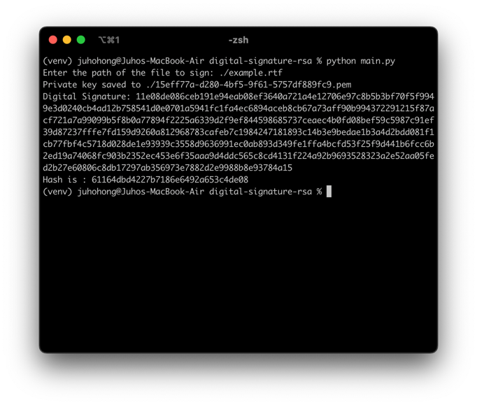
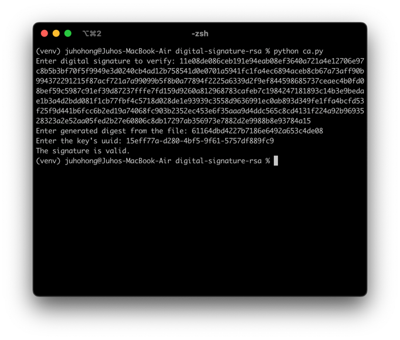

# digital-signature-rsa
Digital Signature Implementation with RSA


## Installation

1. Clone the repository
2. ```pip install -r requirements.txt```

## CLI interaction

### Signing

1. To sign a file, run ```python main.py```
2. CLI will prompt you to enter the path of the file to be signed
3. File will be digested (hashed with md5).
4. The digest will be encrypted with the private key and create a digital signature.
5. The digest and the digital signature will be saved will be printed out in the terminal

### Verifying

1. To verify a file, run ```python ca.py```
2. CLI will prompt you to enter the digital signature and the digest of the file
3. CLI will also prompt you to enter the UUID for the private key (or the file name).
4. CA will find the appropriate public key associated with the UUID and verify the digital signature.
5. Terminal will print out the result of the verification.

### Examples

- Signing


- Verifying
